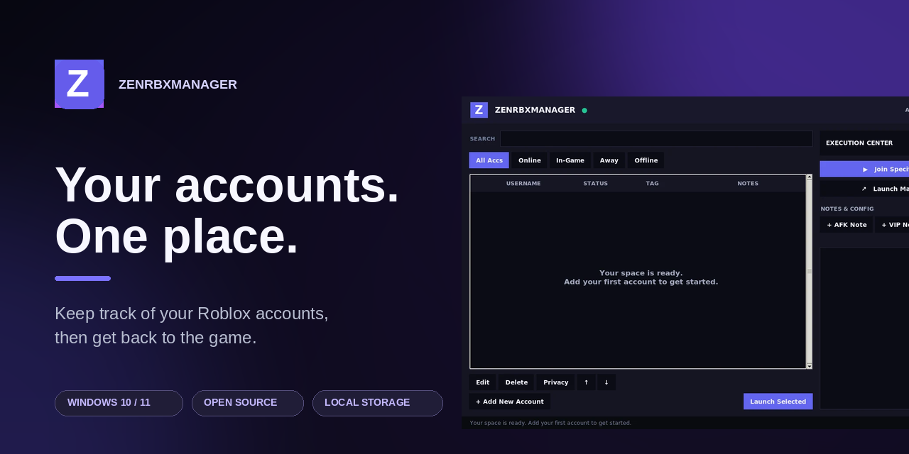
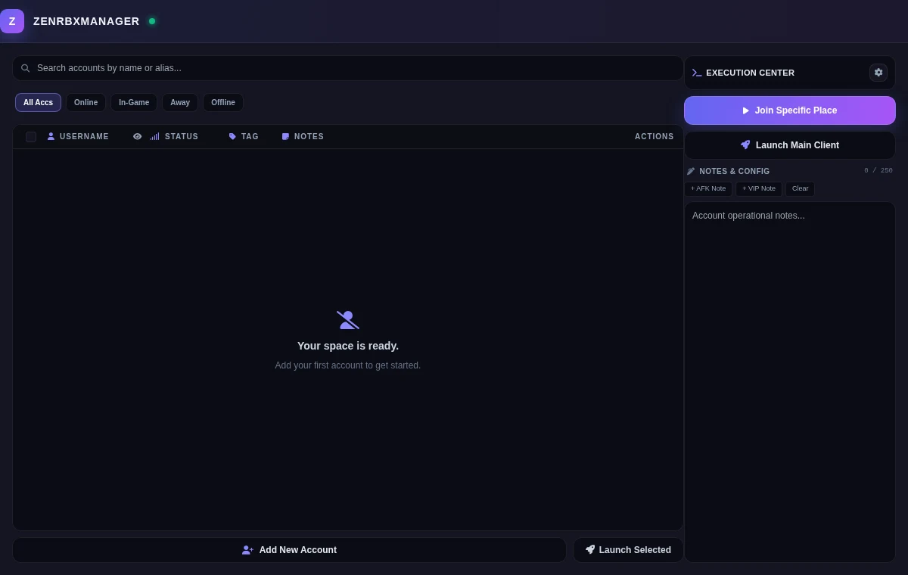
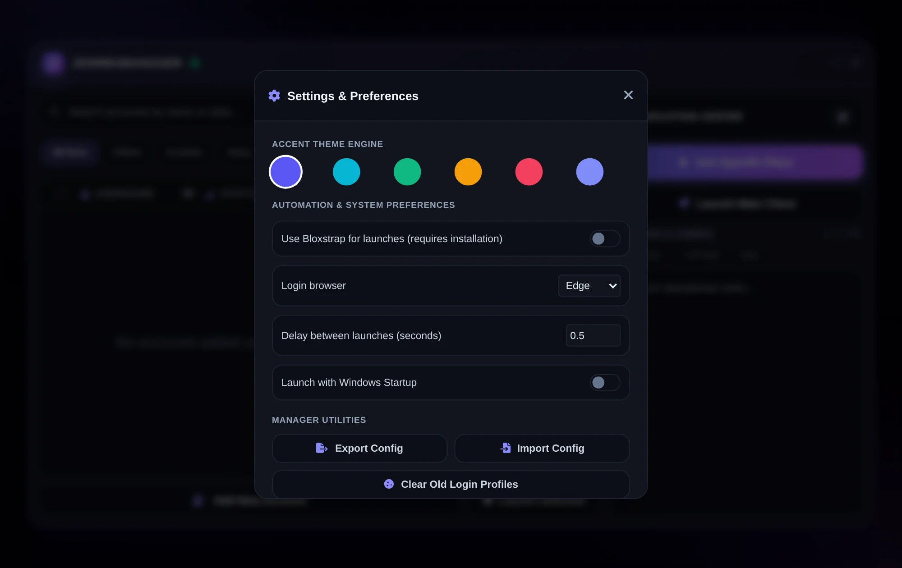

<p align="center">
  
</p>

<div align="center">

# ZenRbxManager

**Too many Roblox accounts to keep straight? Keep them together and get back to the game.**  
A small Windows app for labels, notes, and launching the right account into the right place.

[](https://github.com/sitezu/ZenRbxManager/actions/workflows/windows-build.yml)
[](https://sitezu.github.io/ZenRbxManager/)
[](LICENSE)

[**⬇ Download Windows preview**](https://github.com/sitezu/ZenRbxManager/releases/tag/v0.1.0-preview) · [🌐 Website](https://sitezu.github.io/ZenRbxManager/) · [🧰 Source setup](#run-from-source)

</div>

> [!IMPORTANT]
> **This is a preview, not a fully verified release.** The Windows build passes automated Python and browser-UI tests and a **100 MB executable size limit**, but no real Roblox login or game launch has been tested on a Windows PC here. If you try it, back up your data and [tell us what works or breaks](https://github.com/sitezu/ZenRbxManager/issues). **Never post account cookies, passwords, or auth tickets in an issue.**

If you switch Roblox accounts a lot, you know the routine: which login is this, what was this account for, and where was that game again? ZenRbxManager keeps those little details in one place. It is an independent community project, **not affiliated with Roblox**.

## What it does

| | |
|:---|:---|
| **One account list** · Search, filter, reorder, label, and jot down a note for each account. | **Add accounts your way** · Sign in through a supported browser or import a security cookie from an account you own. |
| **Launch where you want** · Open Roblox Home, a Place ID, or an optional server Job ID. Select more than one account when you need to. | **Know what you’re looking at** · Show online and in-game presence when Roblox makes it available. An unavailable result shows **Unknown**, not a guessed status. |
| **Local account storage** · A new vault is encrypted on your PC. Exported preferences leave out login cookies. | **Make it yours** · Choose an accent color, browser, launch delay, Bloxstrap launcher option, and Windows Startup behavior. |

### A look at the app

These are captures of the interface with an **empty account list**—no real account or cookie is in the images.

<table>
<tr><td width="50%"></td><td width="50%"></td></tr>
<tr><td align="center"><sub>Account workspace</sub></td><td align="center"><sub>Settings and themes</sub></td></tr>
</table>

## Get started on Windows

1. Open the [**preview release**](https://github.com/sitezu/ZenRbxManager/releases/tag/v0.1.0-preview) and download `ZenRbxManager-v0.1.0-preview.exe` (once its Windows build has finished). Check its hash against `SHA256SUMS.txt` if you want to verify the download.
2. Put the EXE in a folder where it can create `AccountManagerData`. Run it on Windows 10/11 with **Edge or Chrome installed**. Roblox itself must be installed to launch a game.
3. Choose **Add New Account**. Use the browser sign-in flow, or import a `.ROBLOSECURITY` cookie that belongs to you. Browser sign-in may need to download a matching WebDriver on first use.
4. Select an account, then launch Roblox Home or enter a Place ID. That’s it.

The EXE is **unsigned**, so Windows SmartScreen may warn you. You should inspect the source before trusting any account tool. If you are upgrading from another account manager, **back up `AccountManagerData` first**. Hardware-encrypted vaults may be tied to the original computer; password-encrypted upstream vaults need migration in the original app before opening them here.

### Run from source

With Python 3.13 and Git installed on Windows:

```powershell
git clone https://github.com/sitezu/ZenRbxManager.git
cd ZenRbxManager
py -3.13 -m venv .venv
.venv\Scripts\activate
pip install -e '.[test]'
python src/main.py
python -m pytest -q
```

The app uses an installed browser as its desktop window; **it does not bundle Chromium or Roblox**. Those programs, optional WebDriver downloads, and your saved account data are outside the executable’s 100 MB size limit.

## Good to know

<details><summary><b>Are my accounts sent to a ZenRbxManager server?</b></summary><br>No app account server is used. The interface talks to a loopback service on your PC, and the backend contacts Roblox for sign-in validation, presence, and launching. Saved account data lives in <code>AccountManagerData</code>. A new setup enables hardware-based encryption.</details>

<details><summary><b>Why does an account say “Unknown”?</b></summary><br>Roblox did not return a reliable presence result. We’d rather show that than claim the account is offline. You can mark an account Away manually.</details>

<details><summary><b>Does this include Auto-Rejoin or minimize-to-tray?</b></summary><br>No. Those controls were in an early visual mockup but are not in this lightweight browser-shell version. The app does not pretend otherwise.</details>

<details><summary><b>Can I run it on macOS or Linux?</b></summary><br>The backend launches Windows Roblox clients, so the app is Windows-only. Some automated tests run on Linux, but that does not make the desktop app cross-platform.</details>

<details><summary><b>Can I copy an account cookie?</b></summary><br>Yes, after a confirmation. A cookie gives access to your account: never send it to someone else, commit it to GitHub, or include it in an issue. Clear your clipboard when finished.</details>

## For contributors

- `src/` — local API, account storage, Roblox integration, Windows entry point.
- `web/` — the desktop interface. `tests/web.test.mjs` checks real account rendering, preferences, notes and HTML escaping.
- `site/` — the [GitHub Pages website](https://sitezu.github.io/ZenRbxManager/), inspired by sitezu’s [ZenTask site](https://github.com/sitezu/Zentask).
- `.github/workflows/windows-build.yml` — tests and builds a Windows artifact, failing at **100,000,000 bytes** or more.
- `.github/workflows/release.yml` — on a `v*` tag, repeats the tests and size check, publishes the EXE, SHA-256 checksum, and GPL license as a **preview release**.
- `.github/workflows/pages.yml` — publishes `site/` to GitHub Pages.

For a future version, update the download links in `README.md` and `site/index.html`, update the release notes, then tag the tested commit. Don’t call a build stable until it has been exercised with a real Roblox account on Windows. The website itself is static; it **never** asks for account credentials.

This project adapts account logic from [evanovar/RobloxAccountManager](https://github.com/evanovar/RobloxAccountManager), licensed GPL-3.0. The website styling adapts [sitezu/Zentask](https://github.com/sitezu/Zentask), licensed MIT. See [ATTRIBUTION.md](ATTRIBUTION.md) and the included licenses. ZenRbxManager is not made or endorsed by Roblox.

---

<div align="center"><sub>Made with care by <a href="https://github.com/sitezu">sitezu</a>. If it helped, a ⭐ on the repo is a lovely way to say so.</sub></div>
