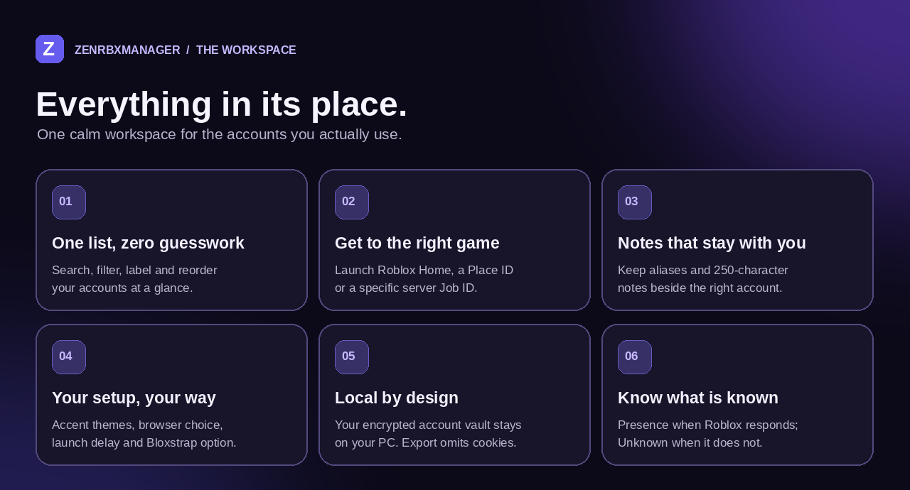

<div align="center">


# ZENRBXMANAGER

### Your accounts. One place. Back to the game.

An independent Windows account workspace for the Roblox accounts **you own**. Keep the details straight, choose where you're going, and launch with confidence.

[](https://github.com/sitezu/ZenRbxManager/actions/workflows/windows-build.yml)
[](https://sitezu.github.io/ZenRbxManager/)
[](LICENSE)

**[Download portable preview](https://github.com/sitezu/ZenRbxManager/releases/tag/v0.1.0-preview)** &nbsp;·&nbsp; **[Explore the website](https://sitezu.github.io/ZenRbxManager/)** &nbsp;·&nbsp; **[Try the setup candidate](#prefer-a-setup-wizard)**

<sub>WINDOWS 10 / 11 &nbsp; • &nbsp; OPEN SOURCE &nbsp; • &nbsp; LOCAL ACCOUNT STORAGE &nbsp; • &nbsp; UNDER 100 MB PER EXECUTABLE</sub>

</div>

> [!IMPORTANT]
> **Preview, not a verified Roblox release.** The portable EXE is published and its download checksum was verified. The newer setup installer is an **Actions test artifact, not a release**. Automated tests cover the interface, backend, packaged startup, size limit, installation and uninstall; **live Roblox sign-in and game launch still need testing on Windows**. The screenshots below show the **new native UI** on `main`. The published v0.1.0-preview is an **older browser-shell build**, not the native app.

---

## A better place for the accounts you actually use

One account for one game, another for a different group, and a third you haven't touched in months. ZenRbxManager gives those accounts a home: a clean list, useful context, and launch controls in a **real native desktop window**. No Edge/Chrome app-mode shell, WebView, HTTP server, or fake window frame.



### See the workspace

These are **real captures of the native Tk desktop window** on a Linux test display, not a populated demo account. Windows uses its actual OS title bar. No credentials or account cookies appear in them.


<details>
<summary><b>See settings and themes ↗</b></summary>
<br>

</details>

## From first launch to the right game

| | What to do | What happens |
|:--:|:--|:--|
| **01** | **Add an account you own** | Sign in in a supported browser, or import your own `.ROBLOSECURITY` cookie. Roblox validates the account; don't give your cookie to anyone else. |
| **02** | **Make it recognizable** | Give it an alias and note. Search, filter, reorder, select, or hide displayed usernames when you need some privacy. |
| **03** | **Choose your destination** | Launch Roblox Home or enter a Place ID. An optional Job ID can target a specific server. Multiple selected accounts can be launched with a configurable delay. |

Presence can show Online or In-Game when Roblox supplies it. If a reliable result isn't available, the app shows **Unknown** instead of guessing.

## Get it for Windows

### Portable preview · published

1. Download **[`ZenRbxManager-v0.1.0-preview.exe`](https://github.com/sitezu/ZenRbxManager/releases/download/v0.1.0-preview/ZenRbxManager-v0.1.0-preview.exe)** from the [v0.1.0-preview release](https://github.com/sitezu/ZenRbxManager/releases/tag/v0.1.0-preview). Compare its SHA-256 hash with the release's `SHA256SUMS.txt`.
2. Keep the EXE in a folder where it can create `AccountManagerData`. This **older portable preview** uses Edge or Chrome for its app window; install Roblox before trying to launch a game. To test the native window, use the newer setup candidate below.
3. Choose **Add New Account**. Browser sign-in can download a matching WebDriver on first use. Only use accounts you own.

**Important:** This published portable preview predates the native Tk rewrite; it **still opens a browser-based app window**. Do not download it to evaluate the new native UI. It is unsigned, so Windows SmartScreen may display a warning. Inspect the source before trusting an account-management app.

### Prefer a setup wizard?

The [latest successful Windows build](https://github.com/sitezu/ZenRbxManager/actions/workflows/windows-build.yml) **for the native-UI commit** provides a **`ZenRbxManager-Setup-Candidate`** artifact. Older Actions artifacts are browser-shell builds; check the run’s commit. Sign in to GitHub, open the successful run, download the artifact ZIP, extract `ZenRbxManager-Setup-candidate.exe`, and verify it using the included `SETUP-SHA256SUMS.txt`.

This **per-user Inno Setup candidate** adds a Start Menu shortcut, offers an optional desktop shortcut, and includes an uninstaller that leaves saved accounts alone. CI checks the under-100 MB limit, creates a real native Tk window (without a Roblox account), silently installs the app, starts the installed native window, and uninstalls it. **None of that verifies a real Roblox login or game launch.** Please use the [real-Windows test checklist](TEST_ON_WINDOWS.md), report non-sensitive failures, and **do not expect a setup release until the live tests pass**.

> [!CAUTION]
> Back up `AccountManagerData` before upgrades, reinstalls or migrations. Hardware-encrypted vaults can be tied to the original computer; an upstream password-encrypted vault may need migration in the original app. **Never paste a password, `.ROBLOSECURITY` cookie, auth ticket or account data file into an issue.**

## A real native window, no app WebView

The **current native candidate** draws the two-column interface with Windows/Tk widgets and calls the existing Python account backend **directly**. The program does **not** start a local web server, launch Edge/Chrome for its UI, host a WebView, or bundle Electron/Chromium. Its maximized native window fills the usable screen, with Windows providing the real title bar and window controls. **Only Roblox's optional browser sign-in flow opens an external browser.** Roblox, optional WebDriver downloads, and saved data are outside the executable's 100 MB size limit. The older published portable preview still uses the previous browser-shell architecture.

| What matters | How it works |
|:--|:--|
| **Local account vault** | Saved account data stays in `AccountManagerData` on your PC; a new vault uses hardware-based encryption. |
| **Settings export** | Exports preferences without login cookies. |
| **Your controls** | Accent theme, sign-in browser, launch delay, optional Bloxstrap integration and Windows Startup. |
| **Transparent limitations** | No Auto-Rejoin and no minimize-to-tray. This preview has not completed live Roblox verification. |

## Run from source

On Windows, with Python 3.13 and Git:

```powershell
git clone https://github.com/sitezu/ZenRbxManager.git
cd ZenRbxManager
py -3.13 -m venv .venv
.venv\Scripts\activate
pip install -e '.[test]'
python src/main.py
python -m pytest -q
```

The running app lives in [`src/native_ui.py`](src/native_ui.py) and [`src/main.py`](src/main.py). [`web/index.html`](web/index.html) is retained **only as the original HTML design reference**; opening it is not a native-app test. The Python GUI test uses real Tk widgets with a fake empty account store. Run it on Linux with `xvfb-run -a python -m pytest -q` or run `python -m pytest -q` on Windows. HTML reference tests: `npm ci --ignore-scripts && npm test`. To regenerate the native screenshots on Linux with Pillow and a virtual display: `xvfb-run -a python scripts/capture_native.py`, then `python scripts/make_banner.py` and `python scripts/make_readme_visuals.py`. No real Roblox account is used in screenshots.

<details>
<summary><b>How are releases tested?</b></summary>
<br>
The <a href=".github/workflows/windows-build.yml">Windows workflow</a> tests Python and JavaScript, builds a portable EXE and a setup candidate, enforces <code>&lt; 100,000,000 bytes</code> for each, and self-tests the packaged and installed app plus the install/uninstall flow. The <a href=".github/workflows/release.yml">release workflow</a> is ready for a <em>future</em> tag. Automated checks cannot replace an owner's Roblox sign-in and launch test on Windows. No new setup tag will be created before that test passes.
</details>

<details>
<summary><b>Can I copy a cookie or report an issue?</b></summary>
<br>
Copying a saved account cookie requires confirmation. A cookie grants account access: clear your clipboard afterward, and never share the cookie, password, token or account data with anyone. For bugs, share only Windows version, steps and non-sensitive error text via <a href="https://github.com/sitezu/ZenRbxManager/issues">GitHub Issues</a>.
</details>

<details>
<summary><b>Does it work on macOS or Linux?</b></summary>
<br>
No. Roblox client launching is Windows-specific. Some tests run on Linux, but the desktop app is intended for Windows 10/11.
</details>

---

### Made in the open

The account backend adapts [evanovar/RobloxAccountManager](https://github.com/evanovar/RobloxAccountManager) under **GPL-3.0**. The project site's visual foundation draws from [sitezu/Zentask](https://github.com/sitezu/Zentask) under **MIT**. Read [ATTRIBUTION.md](ATTRIBUTION.md) and the included licenses. ZenRbxManager is an independent community project, **not affiliated with or endorsed by Roblox**.

<div align="center"><sub>Made with care by <a href="https://github.com/sitezu">sitezu</a> · <a href="https://sitezu.github.io/ZenRbxManager/">Website</a> · <a href="https://github.com/sitezu/ZenRbxManager/issues">Issues</a> · <a href="TEST_ON_WINDOWS.md">Test checklist</a></sub></div>
