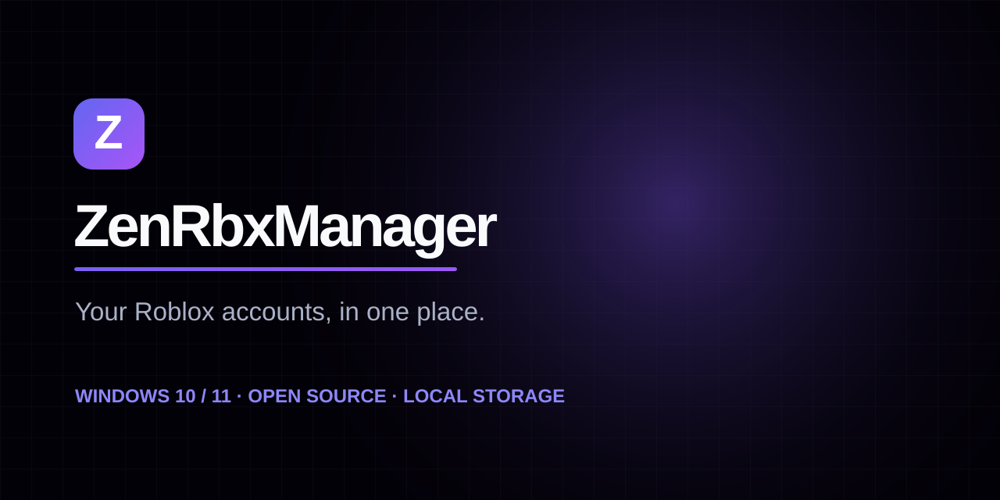

<div align="center">
  

  **Switch accounts often? Keep them together and get back to the game.**  
  Labels, notes and launches in one small Windows app.

  [🌐 Website](https://sitezu.github.io/ZenRbxManager/) · [🛠 Run from source](#run-from-source) · [📦 Windows builds](#building-and-size-limit)
</div>

# ZenRbxManager

> **Release status:** A downloadable Windows release has not been published or verified yet. See the instructions below; the CI workflow will enforce the under-100-MB executable size limit.

If you have more than one Roblox account, you know the routine: find the right login, remember what you were doing, and get back to the game. ZenRbxManager keeps your account list, notes and launch controls together on your PC. It is an independent project, not affiliated with Roblox.

The account backend is adapted from [evanovar/RobloxAccountManager](https://github.com/evanovar/RobloxAccountManager) (GPL-3.0). Its license is included in this repository; redistributions must follow its terms.

## Features

- Add a real account through a Selenium-driven browser login or import a Roblox security cookie. The username is validated with Roblox; the username field on the mockup is informational, not trusted.
- Encrypted local account storage on first run; reads/migrates the upstream `AccountManagerData` format. Existing vaults that require a password are **not** silently replaced: use your original application to migrate them to hardware encryption first. **Back up `AccountManagerData` before switching apps.**
- Search, filter by live Roblox presence (when available), select, reorder, edit alias/notes, manually mark away, delete, and copy cookies after confirmation. Unknown status is shown as Unknown rather than claiming an account is offline. Away is a manual designation.
- Launch the selected account(s) into Roblox Home or a Place ID, optionally a Job ID. Bloxstrap option uses the upstream Bloxstrap launcher; it requires Bloxstrap to already be installed. Launch failures are shown per account.
- Change accent theme, login browser, launch delay, Windows Startup behavior; export/import non-sensitive preferences as JSON; clear old temporary login profiles without deleting saved account cookies.

## Prerequisites

- Windows 10/11; Microsoft Edge or Google Chrome installed (the app does not bundle a browser). Roblox installed for launching accounts.
- For website login: selected browser (Edge, Chrome, or Firefox) and a working Selenium WebDriver; Selenium Manager may download a matching driver on first use. Cookie import does not require WebDriver.
- Internet access to Roblox for cookie validation, live presence and launching. The UI assets work offline; no Tailwind/Font Awesome CDN.

## Run from source

```powershell
py -3.13 -m venv .venv
.venv\Scripts\activate
pip install -e '.[test]'
python src/main.py
python -m pytest -q
```

Run in a folder containing the old `AccountManagerData` to reuse the existing data. The saved data folder, installed Edge/Chrome, Roblox, and Selenium's optional downloaded driver are **not** included in the 100 MB portable-exe size target. If you need a fully self-contained installer including a browser and Roblox, that cannot fit under 100 MB.

## Building and size limit

A Windows GitHub Actions workflow runs the tests, builds a PyInstaller one-file executable, and fails if the executable is 100,000,000 bytes or larger. The binary is attached as a workflow artifact. Build locally with the same command from `.github/workflows/windows-build.yml`. A Windows binary cannot be built or end-to-end tested in a Linux environment; the Windows CI result is the authoritative size check.

## Security

The HTTP server binds only to `127.0.0.1` on a random port; it validates Host, Origin, a random session token and JSON Content-Type on all API requests. It is not a remotely hosted web app. Never paste or commit a GitHub token or Roblox session cookie into the repository. Export Config does not export account cookies. The built-in copy action reveals the cookie to the system clipboard only after confirmation; clear your clipboard afterward. As with upstream, hardware encryption is tied to machine identifiers; keep backups before changing computers.

## Differences from the mockup

The two demonstration accounts and alert-only actions have been removed. Roblox usernames are immutable in the edit dialog (changing text would not change the identity authenticated by the saved cookie). The mockup's Auto-Reconnect and Tray toggles were replaced with working browser and launch-delay preferences, since the lightweight browser shell cannot honestly implement reliable reconnect/tray behavior without a resident process supervisor. The cleanup control clears old temporary login profiles, not saved account credentials.

## Website and GitHub Pages

`site/index.html` is the product website, inspired by [sitezu/Zentask](https://github.com/sitezu/Zentask). It is a static, dependency-free page with no ZenTask app claims or assets. The desktop UI in `web/index.html` uses the same dark-grid/indigo-violet styling. See [ATTRIBUTION.md](ATTRIBUTION.md) for upstream credits.

The repository exists at `sitezu/ZenRbxManager`, but Pages is not live until the website files are pushed and Pages is enabled. In **Settings → Pages → Build and deployment**, choose **Source: GitHub Actions**. The `.github/workflows/pages.yml` workflow publishes only `site/` to `https://sitezu.github.io/ZenRbxManager/`. Until deployment completes, that link will return 404. The website does not advertise a downloadable executable without a tested release.

## Publish to your GitHub account

See the step-by-step [publishing guide](PUBLISH.md) for PowerShell, GitHub Pages setup, and verification.

The public repository `sitezu/ZenRbxManager` already exists with an initial README commit. The local workspace copy has been merged with that initial commit, so it can be pushed normally once authenticated:

```bash
git remote -v  # origin should point to https://github.com/sitezu/ZenRbxManager.git
git push -u origin main
```

If you are using the ZIP instead of this workspace, **clone the existing GitHub repository first**, copy the ZIP's project files into the cloned folder (replacing its starter README), then run `git add .`, `git commit -m "Add ZenRbxManager app and website"`, and `git push`. Do not initialize a separate unrelated Git history from the ZIP and force-push over the repository.

Use your own GitHub authentication or approve a GitHub CLI device sign-in. Do **not** paste or reuse the GitHub token exposed earlier. Never include credentials in a remote URL or commit.
